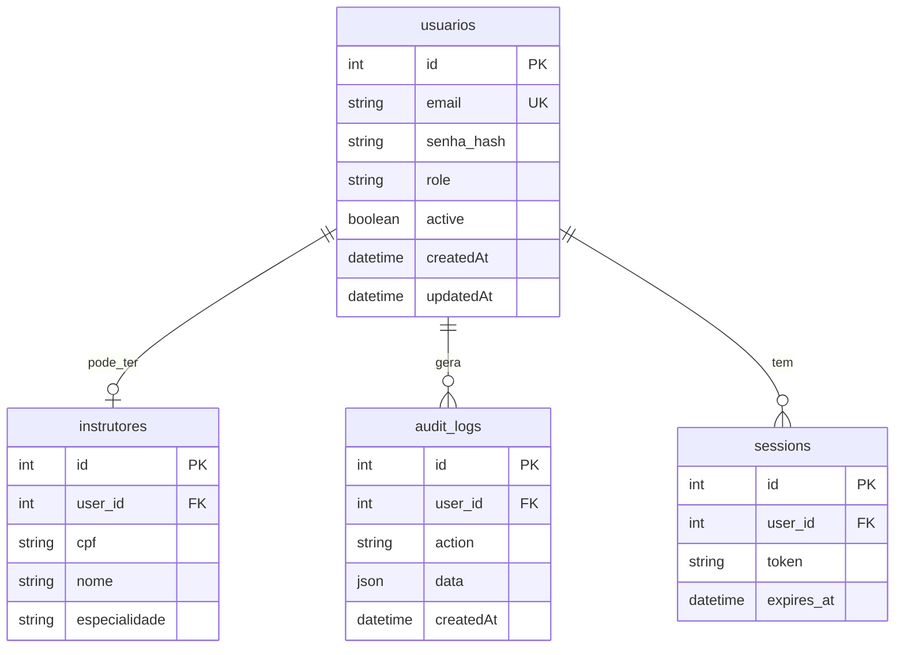

# 👥 Users Module - Módulo de Usuários

Este módulo é responsável pela gestão completa de usuários do sistema SUKATECH, incluindo operações CRUD, perfis e gerenciamento de dados pessoais.

## 📋 Índice

- [Visão Geral](#-visão-geral)
- [Estrutura do Módulo](#-estrutura-do-módulo)
- [Modelo de Dados](#-modelo-de-dados)
- [Controller](#-controller)
- [Rotas](#-rotas)
- [Funcionalidades](#-funcionalidades)
- [Relacionamentos](#-relacionamentos)
- [Validações](#-validações)
- [Segurança](#-segurança)
- [Exemplos de Uso](#-exemplos-de-uso)

## 🎯 Visão Geral

O módulo de usuários gerencia as contas de acesso ao sistema, servindo como base para:

- 🔐 **Sistema de Autenticação** - Base para login e controle de acesso
- 👤 **Perfis de Usuário** - Informações pessoais e profissionais
- 🎭 **Sistema de Roles** - Controle de permissões (ADMIN, INSTRUTOR, COORDENADOR)
- 📊 **Auditoria** - Rastreamento de atividades do usuário
- 🔗 **Relacionamentos** - Conexão com instrutores e outros módulos

## 📁 Estrutura do Módulo

```
src/modules/users/
├── 📄 user.controller.ts    # Controladores HTTP
├── 📄 user.model.ts         # Modelo Sequelize
└── 📄 user.routes.ts        # Definição de rotas
```

### Estrutura Completa Prevista

```
src/modules/users/
├── 📄 user.controller.ts    # Controladores HTTP
├── 📄 user.service.ts       # Lógica de negócio
├── 📄 user.model.ts         # Modelo Sequelize
├── 📄 user.routes.ts        # Definição de rotas
├── 📄 user.validator.ts     # Schemas de validação
├── 📄 user.types.ts         # Tipos TypeScript
└── 📄 README.md             # Esta documentação
```

## 📊 Modelo de Dados

### Estrutura da Tabela `usuarios`

```typescript
// user.model.ts
import { Model, DataTypes } from 'sequelize';
import { sequelize } from '../../config/database.js';

class User extends Model {
  public id!: number;
  public email!: string;
  public senha_hash!: string;
  public role!: string;
  
  // Timestamps automáticos
  public readonly createdAt!: Date;
  public readonly updatedAt!: Date;
}

User.init({
  id: {
    type: DataTypes.INTEGER,
    autoIncrement: true,
    primaryKey: true,
  },
  email: {
    type: DataTypes.STRING(100),
    allowNull: false,
    unique: true,
    validate: {
      isEmail: true,
    }
  },
  senha_hash: {
    type: DataTypes.STRING(255),
    allowNull: false,
  },
  role: {
    type: DataTypes.STRING(50),
    allowNull: false,
    defaultValue: 'INSTRUTOR',
    validate: {
      isIn: [['ADMIN', 'INSTRUTOR', 'COORDENADOR']]
    }
  }
}, {
  sequelize,
  tableName: 'usuarios',
  timestamps: true,
});

export default User;
```

### Campos Detalhados

| Campo | Tipo | Descrição | Constraints |
|-------|------|-----------|-------------|
| `id` | INTEGER | Chave primária | AUTO_INCREMENT, NOT NULL |
| `email` | VARCHAR(100) | Email único para login | NOT NULL, UNIQUE, VALID_EMAIL |
| `senha_hash` | VARCHAR(255) | Senha hasheada com bcrypt | NOT NULL, MIN_LENGTH(60) |
| `role` | VARCHAR(50) | Papel do usuário no sistema | NOT NULL, ENUM |
| `createdAt` | DATETIME | Data de criação | AUTO_GENERATED |
| `updatedAt` | DATETIME | Data de atualização | AUTO_UPDATED |

### Roles Disponíveis

```typescript
enum UserRole {
  ADMIN = 'ADMIN',           // Administrador do sistema
  INSTRUTOR = 'INSTRUTOR',   // Professor/Instrutor
  COORDENADOR = 'COORDENADOR' // Coordenador de cursos
}
```

**Hierarquia de Permissões**:
- 👑 **ADMIN**: Acesso total ao sistema
- 👨‍🏫 **INSTRUTOR**: Gestão de turmas e presença
- 📋 **COORDENADOR**: Gestão de cursos e matrículas

## 🎮 Controller

### Implementação Atual

```typescript
// user.controller.ts
import type { Request, Response } from 'express';
import User from './user.model.js';

export class UserController {
  async list(req: Request, res: Response) {
    try {
      const users = await User.findAll({
        attributes: { exclude: ['senha_hash'] } // Não retornar senha
      });
      return res.json({ users });
    } catch (error: any) {
      return res.status(500).json({ message: error.message });
    }
  }

  async getById(req: Request, res: Response) {
    try {
      const { id } = req.params;
      const user = await User.findByPk(id, {
        attributes: { exclude: ['senha_hash'] }
      });
      
      if (!user) {
        return res.status(404).json({ message: 'Usuário não encontrado' });
      }
      
      return res.json({ user });
    } catch (error: any) {
      return res.status(500).json({ message: error.message });
    }
  }

  async update(req: Request, res: Response) {
    try {
      const { id } = req.params;
      const updateData = req.body;
      
      const [updatedRows] = await User.update(updateData, {
        where: { id }
      });
      
      if (updatedRows === 0) {
        return res.status(404).json({ message: 'Usuário não encontrado' });
      }
      
      const updatedUser = await User.findByPk(id, {
        attributes: { exclude: ['senha_hash'] }
      });
      
      return res.json({ user: updatedUser });
    } catch (error: any) {
      return res.status(500).json({ message: error.message });
    }
  }

  async delete(req: Request, res: Response) {
    try {
      const { id } = req.params;
      const deletedRows = await User.destroy({
        where: { id }
      });
      
      if (deletedRows === 0) {
        return res.status(404).json({ message: 'Usuário não encontrado' });
      }
      
      return res.status(204).send();
    } catch (error: any) {
      return res.status(500).json({ message: error.message });
    }
  }
}
```

### Melhorias Planejadas

```typescript
// user.service.ts (futuro)
export class UserService {
  async getAllUsers(filters?: UserFilters): Promise<User[]> {
    // Lógica de negócio para listar usuários
  }

  async getUserById(id: number): Promise<User | null> {
    // Lógica de negócio para buscar usuário
  }

  async updateUser(id: number, data: UpdateUserDTO): Promise<User> {
    // Lógica de negócio para atualizar usuário
  }

  async changePassword(id: number, oldPassword: string, newPassword: string): Promise<void> {
    // Lógica para alterar senha
  }

  async deactivateUser(id: number): Promise<void> {
    // Lógica para desativar usuário (soft delete)
  }
}
```

## 🛣️ Rotas

### Implementação Atual

```typescript
// user.routes.ts
import { Router } from 'express';
import { UserController } from './user.controller.js';

const router = Router();
const userController = new UserController();

// Listar todos os usuários
router.get('/', userController.list);

// Buscar usuário por ID
router.get('/:id', userController.getById);

// Atualizar usuário
router.put('/:id', userController.update);

// Deletar usuário
router.delete('/:id', userController.delete);

export default router;
```

### Rotas Planejadas

| Método | Endpoint | Descrição | Auth | Role |
|--------|----------|-----------|------|------|
| GET | `/` | Listar usuários | ✅ | ADMIN |
| GET | `/:id` | Buscar por ID | ✅ | ADMIN ou próprio |
| POST | `/` | Criar usuário | ✅ | ADMIN |
| PUT | `/:id` | Atualizar completo | ✅ | ADMIN ou próprio |
| PATCH | `/:id` | Atualizar parcial | ✅ | ADMIN ou próprio |
| DELETE | `/:id` | Deletar usuário | ✅ | ADMIN |
| POST | `/:id/change-password` | Alterar senha | ✅ | Qualquer |
| PUT | `/:id/role` | Alterar role | ✅ | ADMIN |
| POST | `/:id/deactivate` | Desativar | ✅ | ADMIN |
| POST | `/:id/activate` | Ativar | ✅ | ADMIN |

## ⚡ Funcionalidades

### Funcionalidades Implementadas

- ✅ **Listar Usuários** - Busca todos os usuários (sem senhas)
- ✅ **Buscar por ID** - Localiza usuário específico
- ✅ **Atualizar Usuário** - Modifica dados do usuário
- ✅ **Deletar Usuário** - Remove usuário do sistema

### Funcionalidades Planejadas

- [ ] 📝 **Criar Usuário** - Cadastro manual de usuários
- [ ] 🔑 **Alterar Senha** - Mudança segura de senha
- [ ] 🎭 **Gerenciar Roles** - Alterar permissões
- [ ] 🔍 **Busca Avançada** - Filtros e paginação
- [ ] 📊 **Relatórios** - Estatísticas de usuários
- [ ] 🔄 **Histórico** - Log de alterações
- [ ] 📧 **Notificações** - Emails de alterações
- [ ] 🚫 **Soft Delete** - Desativação em vez de exclusão

### Exemplo de Busca Avançada

```typescript
// Futuro: Busca com filtros
async function searchUsers(filters: {
  role?: UserRole;
  search?: string;
  active?: boolean;
  page?: number;
  limit?: number;
}) {
  const whereClause: any = {};
  
  if (filters.role) {
    whereClause.role = filters.role;
  }
  
  if (filters.search) {
    whereClause.email = {
      [Op.iLike]: `%${filters.search}%`
    };
  }
  
  if (filters.active !== undefined) {
    whereClause.active = filters.active;
  }
  
  const offset = ((filters.page || 1) - 1) * (filters.limit || 10);
  
  return User.findAndCountAll({
    where: whereClause,
    attributes: { exclude: ['senha_hash'] },
    limit: filters.limit || 10,
    offset,
    order: [['createdAt', 'DESC']]
  });
}
```

## 🔗 Relacionamentos

### Relacionamentos Implementados

Atualmente, o modelo User é independente, mas pode ser referenciado por:

```typescript
// Relacionamento futuro com instrutores
User.hasOne(Instructor, { 
  foreignKey: 'user_id',
  as: 'instructorProfile' 
});

Instructor.belongsTo(User, { 
  foreignKey: 'user_id',
  as: 'user' 
});
```

### Relacionamentos Planejados



## ✅ Validações

### Schemas de Validação (Planejados)

```typescript
// user.validator.ts
import { z } from 'zod';

export const createUserSchema = z.object({
  email: z
    .string()
    .email('Email inválido')
    .min(1, 'Email é obrigatório')
    .max(100, 'Email muito longo'),
    
  senha: z
    .string()
    .min(8, 'Senha deve ter pelo menos 8 caracteres')
    .max(100, 'Senha muito longa')
    .regex(/^(?=.*[a-z])(?=.*[A-Z])(?=.*\d)/, 
      'Senha deve conter ao menos: 1 minúscula, 1 maiúscula, 1 número'),
    
  role: z
    .enum(['ADMIN', 'INSTRUTOR', 'COORDENADOR'])
    .default('INSTRUTOR')
});

export const updateUserSchema = z.object({
  email: z
    .string()
    .email('Email inválido')
    .max(100, 'Email muito longo')
    .optional(),
    
  role: z
    .enum(['ADMIN', 'INSTRUTOR', 'COORDENADOR'])
    .optional()
});

export const changePasswordSchema = z.object({
  senhaAtual: z
    .string()
    .min(1, 'Senha atual é obrigatória'),
    
  novaSenha: z
    .string()
    .min(8, 'Nova senha deve ter pelo menos 8 caracteres')
    .max(100, 'Nova senha muito longa')
});

export const roleUpdateSchema = z.object({
  role: z.enum(['ADMIN', 'INSTRUTOR', 'COORDENADOR'])
});
```

### Validações no Modelo

```typescript
// Validações do Sequelize
User.init({
  email: {
    type: DataTypes.STRING(100),
    allowNull: false,
    unique: {
      name: 'unique_email',
      msg: 'Este email já está sendo usado'
    },
    validate: {
      isEmail: {
        msg: 'Email deve ter formato válido'
      },
      notEmpty: {
        msg: 'Email não pode estar vazio'
      }
    }
  },
  role: {
    type: DataTypes.STRING(50),
    allowNull: false,
    validate: {
      isIn: {
        args: [['ADMIN', 'INSTRUTOR', 'COORDENADOR']],
        msg: 'Role deve ser ADMIN, INSTRUTOR ou COORDENADOR'
      }
    }
  }
}, {
  // Hooks de validação
  hooks: {
    beforeCreate: async (user: User) => {
      // Validações customizadas antes de criar
      if (user.role === 'ADMIN') {
        // Verificar se já existe admin
        const adminCount = await User.count({ where: { role: 'ADMIN' } });
        if (adminCount >= 3) {
          throw new Error('Máximo de 3 administradores permitidos');
        }
      }
    }
  }
});
```

## 🛡️ Segurança

### Proteção de Dados Sensíveis

```typescript
// Sempre excluir senha_hash das respostas
const userPublicData = {
  attributes: { exclude: ['senha_hash'] }
};

// Métodos do modelo para dados seguros
User.prototype.toSafeObject = function() {
  const { senha_hash, ...safeData } = this.toJSON();
  return safeData;
};
```

### Controle de Acesso

```typescript
// middleware/checkUserAccess.ts
export function checkUserAccess(req: Request, res: Response, next: NextFunction) {
  const requestedUserId = parseInt(req.params.id);
  const currentUser = req.user;
  
  // Admin pode acessar qualquer usuário
  if (currentUser.role === 'ADMIN') {
    return next();
  }
  
  // Usuário só pode acessar próprios dados
  if (currentUser.id === requestedUserId.toString()) {
    return next();
  }
  
  throw new AppError('Acesso negado', 403);
}
```

### Auditoria (Planejada)

```typescript
// Hooks para auditoria
User.addHook('afterUpdate', async (user: User, options) => {
  await AuditLog.create({
    user_id: options.userId, // ID de quem fez a alteração
    target_user_id: user.id,
    action: 'UPDATE_USER',
    data: user.changed(),
    ip_address: options.ipAddress
  });
});
```

## 📝 Exemplos de Uso

### Listar Usuários

```bash
curl -X GET http://localhost:3333/api/users \
  -H "Authorization: Bearer SEU_TOKEN"
```

```json
{
  "users": [
    {
      "id": 1,
      "email": "admin@sukatech.com",
      "role": "ADMIN",
      "createdAt": "2024-10-06T10:00:00.000Z",
      "updatedAt": "2024-10-06T10:00:00.000Z"
    },
    {
      "id": 2,
      "email": "instrutor@sukatech.com", 
      "role": "INSTRUTOR",
      "createdAt": "2024-10-06T11:00:00.000Z",
      "updatedAt": "2024-10-06T11:00:00.000Z"
    }
  ]
}
```

### Buscar Usuário por ID

```bash
curl -X GET http://localhost:3333/api/users/1 \
  -H "Authorization: Bearer SEU_TOKEN"
```

```json
{
  "user": {
    "id": 1,
    "email": "admin@sukatech.com",
    "role": "ADMIN", 
    "createdAt": "2024-10-06T10:00:00.000Z",
    "updatedAt": "2024-10-06T10:00:00.000Z"
  }
}
```

### Atualizar Usuário

```bash
curl -X PUT http://localhost:3333/api/users/1 \
  -H "Authorization: Bearer SEU_TOKEN" \
  -H "Content-Type: application/json" \
  -d '{
    "email": "novo.email@sukatech.com",
    "role": "COORDENADOR"
  }'
```

### Exemplo em JavaScript

```typescript
// Cliente exemplo
class UserService {
  private baseUrl = 'http://localhost:3333/api';
  private token: string;

  constructor(token: string) {
    this.token = token;
  }

  private get headers() {
    return {
      'Authorization': `Bearer ${this.token}`,
      'Content-Type': 'application/json'
    };
  }

  async getUsers(): Promise<User[]> {
    const response = await fetch(`${this.baseUrl}/users`, {
      headers: this.headers
    });
    
    if (!response.ok) {
      throw new Error('Erro ao buscar usuários');
    }
    
    const data = await response.json();
    return data.users;
  }

  async getUserById(id: number): Promise<User> {
    const response = await fetch(`${this.baseUrl}/users/${id}`, {
      headers: this.headers
    });
    
    if (!response.ok) {
      throw new Error('Usuário não encontrado');
    }
    
    const data = await response.json();
    return data.user;
  }

  async updateUser(id: number, userData: Partial<User>): Promise<User> {
    const response = await fetch(`${this.baseUrl}/users/${id}`, {
      method: 'PUT',
      headers: this.headers,
      body: JSON.stringify(userData)
    });
    
    if (!response.ok) {
      throw new Error('Erro ao atualizar usuário');
    }
    
    const data = await response.json();
    return data.user;
  }
}
```

## 🧪 Testes

### Estrutura de Testes

```
test/modules/users/
├── user.controller.test.ts
├── user.model.test.ts
├── user.routes.test.ts
└── user.service.test.ts
```

### Exemplo de Teste

```typescript
// test/modules/users/user.controller.test.ts
describe('User Controller', () => {
  describe('GET /users', () => {
    it('should list users for admin', async () => {
      const adminToken = await createAdminToken();
      
      const response = await request(app)
        .get('/api/users')
        .set('Authorization', `Bearer ${adminToken}`)
        .expect(200);

      expect(response.body).toHaveProperty('users');
      expect(Array.isArray(response.body.users)).toBe(true);
      
      // Verificar que senhas não são retornadas
      response.body.users.forEach((user: any) => {
        expect(user).not.toHaveProperty('senha_hash');
      });
    });

    it('should deny access for non-admin', async () => {
      const userToken = await createUserToken();
      
      await request(app)
        .get('/api/users')
        .set('Authorization', `Bearer ${userToken}`)
        .expect(403);
    });
  });
});
```

## 🚀 Roadmap

### Próximas Implementações

1. **Service Layer** - Lógica de negócio separada
2. **Validações Completas** - Schemas Zod implementados  
3. **Soft Delete** - Desativação em vez de exclusão
4. **Auditoria** - Log de todas as alterações
5. **Filtros Avançados** - Busca e paginação
6. **Perfis Estendidos** - Dados adicionais por role
7. **Notificações** - Emails para alterações importantes

### Melhorias Técnicas

- [ ] 🧪 Testes unitários completos
- [ ] 📝 Documentação de API (Swagger)
- [ ] 🔐 Políticas de senha mais rigorosas
- [ ] 📊 Métricas de uso
- [ ] 🔍 Logging estruturado
- [ ] 💾 Cache de consultas frequentes

---

**Módulo desenvolvido com ❤️ pela equipe SUKATECH**

> 💡 **Dica**: O módulo de usuários é fundamental para todo o sistema. Mantenha sempre a segurança em primeiro lugar e nunca exponha dados sensíveis como senhas nas APIs.