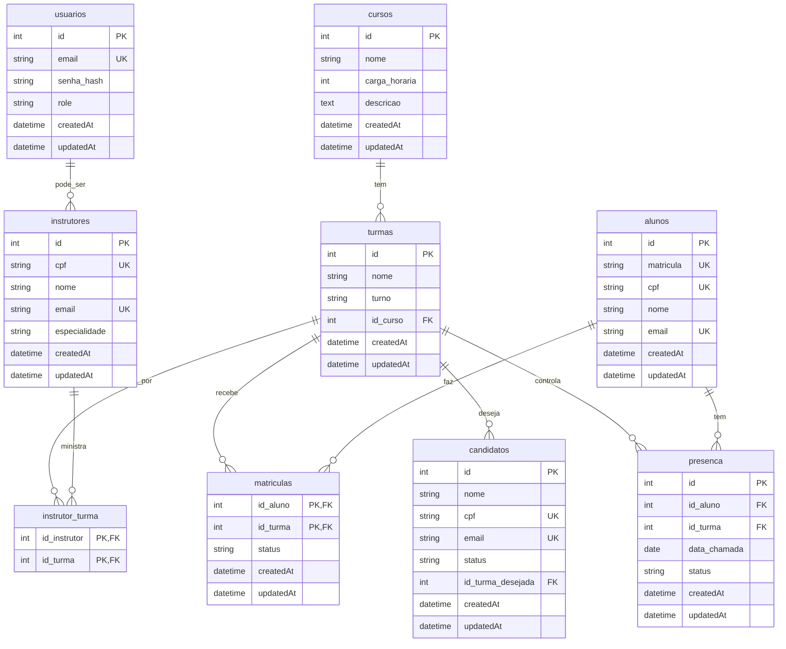

# 🗄️ Database Module - Módulo de Banco de Dados

Este módulo contém toda a estrutura de banco de dados do sistema SUKATECH, incluindo migrações, configurações e documentação do schema.

## 📋 Índice

- [Visão Geral](#-visão-geral)
- [Estrutura do Módulo](#-estrutura-do-módulo)
- [Schema do Banco](#-schema-do-banco)
- [Migrações](#-migrações)
- [Relacionamentos](#-relacionamentos)
- [Sequelize CLI](#-sequelize-cli)
- [Melhores Práticas](#-melhores-práticas)
- [Exemplos de Query](#-exemplos-de-query)

## 🎯 Visão Geral

O banco de dados do SUKATECH foi projetado para gerenciar um sistema completo de cursos técnicos, incluindo:

- 👥 **Gestão de Usuários** - Sistema de autenticação e autorização
- 📚 **Catálogo de Cursos** - Cursos disponíveis na instituição
- 🏫 **Gestão de Turmas** - Turmas específicas de cada curso
- 👨‍🎓 **Alunos e Matrículas** - Estudantes e suas inscrições
- 👨‍🏫 **Instrutores** - Professores e suas especializações
- 🎯 **Candidatos** - Processo seletivo e lista de espera
- ✅ **Controle de Presença** - Registro de frequência dos alunos

## 📁 Estrutura do Módulo

```
src/database/
└── 📁 migrations/
    └── 📄 20250918234918-create-initial-schema.cjs
```

### Estrutura Completa Prevista

```
src/database/
├── 📁 migrations/          # Scripts de migração
│   ├── 📄 001-create-initial-schema.cjs
│   ├── 📄 002-add-indexes.cjs
│   └── 📄 003-add-constraints.cjs
│
├── 📁 seeders/            # Dados iniciais (futuro)
│   ├── 📄 001-admin-user.cjs
│   ├── 📄 002-sample-courses.cjs
│   └── 📄 003-demo-data.cjs
│
└── 📄 README.md           # Esta documentação
```

## 🗄️ Schema do Banco

### Diagrama de Relacionamentos



## 📊 Tabelas Detalhadas

### 🔐 usuarios
**Propósito**: Autenticação e autorização no sistema

| Campo | Tipo | Descrição | Constraints |
|-------|------|-----------|-------------|
| `id` | INTEGER | Chave primária | AUTO_INCREMENT, NOT NULL |
| `email` | VARCHAR(100) | Email único para login | NOT NULL, UNIQUE |
| `senha_hash` | VARCHAR(255) | Senha hasheada com bcrypt | NOT NULL |
| `role` | VARCHAR(50) | Papel do usuário | NOT NULL, DEFAULT 'INSTRUTOR' |
| `createdAt` | DATETIME | Data de criação | NOT NULL |
| `updatedAt` | DATETIME | Data de atualização | NOT NULL |

**Roles Válidos**: `ADMIN`, `INSTRUTOR`, `COORDENADOR`

### 📚 cursos
**Propósito**: Catálogo de cursos oferecidos pela instituição

| Campo | Tipo | Descrição | Constraints |
|-------|------|-----------|-------------|
| `id` | INTEGER | Chave primária | AUTO_INCREMENT, NOT NULL |
| `nome` | VARCHAR(100) | Nome do curso | NOT NULL |
| `carga_horaria` | INTEGER | Horas totais do curso | NOT NULL |
| `descricao` | TEXT | Descrição detalhada | NULLABLE |
| `createdAt` | DATETIME | Data de criação | NOT NULL |
| `updatedAt` | DATETIME | Data de atualização | NOT NULL |

### 🏫 turmas
**Propósito**: Turmas específicas dos cursos com horários

| Campo | Tipo | Descrição | Constraints |
|-------|------|-----------|-------------|
| `id` | INTEGER | Chave primária | AUTO_INCREMENT, NOT NULL |
| `nome` | VARCHAR(100) | Nome/código da turma | NOT NULL |
| `turno` | VARCHAR(50) | Período das aulas | NOT NULL |
| `id_curso` | INTEGER | Referência ao curso | NOT NULL, FK → cursos.id |
| `createdAt` | DATETIME | Data de criação | NOT NULL |
| `updatedAt` | DATETIME | Data de atualização | NOT NULL |

**Turnos Válidos**: `MANHÃ`, `TARDE`, `NOITE`, `INTEGRAL`

### 👨‍🎓 alunos
**Propósito**: Estudantes matriculados na instituição

| Campo | Tipo | Descrição | Constraints |
|-------|------|-----------|-------------|
| `id` | INTEGER | Chave primária | AUTO_INCREMENT, NOT NULL |
| `matricula` | VARCHAR(50) | Matrícula única do aluno | NOT NULL, UNIQUE |
| `cpf` | VARCHAR(11) | CPF do aluno | NOT NULL, UNIQUE |
| `nome` | VARCHAR(100) | Nome completo | NOT NULL |
| `email` | VARCHAR(100) | Email do aluno | NOT NULL, UNIQUE |
| `createdAt` | DATETIME | Data de criação | NOT NULL |
| `updatedAt` | DATETIME | Data de atualização | NOT NULL |

### 👨‍🏫 instrutores
**Propósito**: Professores e suas especializações

| Campo | Tipo | Descrição | Constraints |
|-------|------|-----------|-------------|
| `id` | INTEGER | Chave primária | AUTO_INCREMENT, NOT NULL |
| `cpf` | VARCHAR(11) | CPF do instrutor | NOT NULL, UNIQUE |
| `nome` | VARCHAR(100) | Nome completo | NOT NULL |
| `email` | VARCHAR(100) | Email do instrutor | NOT NULL, UNIQUE |
| `especialidade` | VARCHAR(100) | Área de especialização | NULLABLE |
| `createdAt` | DATETIME | Data de criação | NOT NULL |
| `updatedAt` | DATETIME | Data de atualização | NOT NULL |

### 🎯 candidatos
**Propósito**: Processo seletivo e lista de espera

| Campo | Tipo | Descrição | Constraints |
|-------|------|-----------|-------------|
| `id` | INTEGER | Chave primária | AUTO_INCREMENT, NOT NULL |
| `nome` | VARCHAR(100) | Nome completo | NOT NULL |
| `cpf` | VARCHAR(11) | CPF do candidato | NOT NULL, UNIQUE |
| `email` | VARCHAR(100) | Email do candidato | NOT NULL, UNIQUE |
| `status` | VARCHAR(50) | Status da candidatura | NOT NULL, DEFAULT 'PENDENTE' |
| `id_turma_desejada` | INTEGER | Turma pretendida | NULLABLE, FK → turmas.id |
| `createdAt` | DATETIME | Data de criação | NOT NULL |
| `updatedAt` | DATETIME | Data de atualização | NOT NULL |

**Status Válidos**: `PENDENTE`, `APROVADO`, `REPROVADO`, `MATRICULADO`

### 📝 matriculas (Tabela de Relacionamento)
**Propósito**: Relaciona alunos com turmas

| Campo | Tipo | Descrição | Constraints |
|-------|------|-----------|-------------|
| `id_aluno` | INTEGER | Referência ao aluno | PK, FK → alunos.id |
| `id_turma` | INTEGER | Referência à turma | PK, FK → turmas.id |
| `status` | VARCHAR(50) | Status da matrícula | NOT NULL, DEFAULT 'Cursando' |
| `createdAt` | DATETIME | Data de criação | NOT NULL |
| `updatedAt` | DATETIME | Data de atualização | NOT NULL |

**Status Válidos**: `Cursando`, `Concluído`, `Trancado`, `Cancelado`

### 👥 instrutor_turma (Tabela de Relacionamento)
**Propósito**: Relaciona instrutores com turmas

| Campo | Tipo | Descrição | Constraints |
|-------|------|-----------|-------------|
| `id_instrutor` | INTEGER | Referência ao instrutor | PK, FK → instrutores.id |
| `id_turma` | INTEGER | Referência à turma | PK, FK → turmas.id |

### ✅ presenca
**Propósito**: Controle de frequência dos alunos

| Campo | Tipo | Descrição | Constraints |
|-------|------|-----------|-------------|
| `id` | INTEGER | Chave primária | AUTO_INCREMENT, NOT NULL |
| `id_aluno` | INTEGER | Referência ao aluno | NOT NULL, FK → alunos.id |
| `id_turma` | INTEGER | Referência à turma | NOT NULL, FK → turmas.id |
| `data_chamada` | DATE | Data da chamada | NOT NULL |
| `status` | VARCHAR(20) | Presente/Ausente | NOT NULL |
| `createdAt` | DATETIME | Data de criação | NOT NULL |
| `updatedAt` | DATETIME | Data de atualização | NOT NULL |

**Status Válidos**: `PRESENTE`, `AUSENTE`, `JUSTIFICADO`

## 🔄 Migrações

### Migração Principal: `20250918234918-create-initial-schema.cjs`

Esta migração cria toda a estrutura inicial do banco de dados:

```javascript
'use strict';

module.exports = {
  async up(queryInterface, Sequelize) {
    // 1. Tabelas independentes (sem FK)
    await queryInterface.createTable('usuarios', { /* definição */ });
    await queryInterface.createTable('cursos', { /* definição */ });
    await queryInterface.createTable('instrutores', { /* definição */ });
    await queryInterface.createTable('alunos', { /* definição */ });

    // 2. Tabelas com FK
    await queryInterface.createTable('turmas', { /* definição */ });
    await queryInterface.createTable('candidatos', { /* definição */ });

    // 3. Tabelas de relacionamento
    await queryInterface.createTable('matriculas', { /* definição */ });
    await queryInterface.createTable('instrutor_turma', { /* definição */ });
    await queryInterface.createTable('presenca', { /* definição */ });
  },

  async down(queryInterface, Sequelize) {
    // Ordem inversa para evitar conflitos de FK
    await queryInterface.dropTable('presenca');
    await queryInterface.dropTable('instrutor_turma');
    await queryInterface.dropTable('matriculas');
    await queryInterface.dropTable('candidatos');
    await queryInterface.dropTable('turmas');
    await queryInterface.dropTable('alunos');
    await queryInterface.dropTable('instrutores');
    await queryInterface.dropTable('cursos');
    await queryInterface.dropTable('usuarios');
  }
};
```

### Executando Migrações

```bash
# Executar migrações pendentes
npm run migrate

# Verificar status das migrações
npx sequelize-cli db:migrate:status

# Reverter última migração
npm run migrate:undo

# Reverter todas as migrações
npx sequelize-cli db:migrate:undo:all
```

## 🔗 Relacionamentos

### Tipos de Relacionamento

#### Um para Muitos (1:N)
- **cursos → turmas**: Um curso pode ter várias turmas
- **turmas → candidatos**: Uma turma pode ter vários candidatos
- **turmas → presenca**: Uma turma tem vários registros de presença

#### Muitos para Muitos (N:M)
- **alunos ↔ turmas** (via matriculas): Alunos podem se matricular em várias turmas
- **instrutores ↔ turmas** (via instrutor_turma): Instrutores podem ministrar várias turmas

#### Configuração no Sequelize

```typescript
// models/associations.ts
import User from './User.js';
import Course from './Course.js';
import Class from './Class.js';
import Student from './Student.js';
import Instructor from './Instructor.js';

// Um curso tem várias turmas
Course.hasMany(Class, { foreignKey: 'id_curso', as: 'turmas' });
Class.belongsTo(Course, { foreignKey: 'id_curso', as: 'curso' });

// Alunos e turmas (muitos para muitos)
Student.belongsToMany(Class, { 
  through: 'matriculas', 
  foreignKey: 'id_aluno',
  otherKey: 'id_turma',
  as: 'turmas'
});

Class.belongsToMany(Student, { 
  through: 'matriculas', 
  foreignKey: 'id_turma',
  otherKey: 'id_aluno',
  as: 'alunos'
});

// Instrutores e turmas (muitos para muitos)
Instructor.belongsToMany(Class, { 
  through: 'instrutor_turma', 
  foreignKey: 'id_instrutor',
  otherKey: 'id_turma',
  as: 'turmas'
});

Class.belongsToMany(Instructor, { 
  through: 'instrutor_turma', 
  foreignKey: 'id_turma',
  otherKey: 'id_instrutor',
  as: 'instrutores'
});
```

## 🔧 Sequelize CLI

### Comandos Úteis

```bash
# Criar nova migração
npx sequelize-cli migration:generate --name add-new-column

# Criar seeder
npx sequelize-cli seed:generate --name demo-users

# Executar seeders
npx sequelize-cli db:seed:all

# Reverter seeder específico
npx sequelize-cli db:seed:undo --seed filename

# Criar backup da estrutura
mysqldump -u root -p --no-data sukatechdb > schema_backup.sql
```

### Exemplo de Nova Migração

```javascript
// migrations/add-phone-to-students.cjs
'use strict';

module.exports = {
  async up(queryInterface, Sequelize) {
    await queryInterface.addColumn('alunos', 'telefone', {
      type: Sequelize.STRING(15),
      allowNull: true,
    });
  },

  async down(queryInterface, Sequelize) {
    await queryInterface.removeColumn('alunos', 'telefone');
  }
};
```

## 💡 Melhores Práticas

### Naming Conventions

```sql
-- ✅ Nomes em português (contexto brasileiro)
CREATE TABLE alunos (
  id INTEGER PRIMARY KEY,
  nome VARCHAR(100) NOT NULL
);

-- ✅ Foreign keys descritivas
ALTER TABLE turmas ADD CONSTRAINT fk_turma_curso 
  FOREIGN KEY (id_curso) REFERENCES cursos(id);

-- ✅ Índices nomeados
CREATE INDEX idx_aluno_cpf ON alunos(cpf);
CREATE INDEX idx_presenca_data ON presenca(data_chamada);
```

### Performance

```sql
-- ✅ Índices para consultas frequentes
CREATE INDEX idx_matricula_status ON matriculas(status);
CREATE INDEX idx_presenca_aluno_data ON presenca(id_aluno, data_chamada);

-- ✅ Índices compostos para queries específicas
CREATE INDEX idx_candidato_status_turma ON candidatos(status, id_turma_desejada);
```

### Segurança

```sql
-- ✅ Constraints para integridade
ALTER TABLE matriculas 
  ADD CONSTRAINT chk_status_valido 
  CHECK (status IN ('Cursando', 'Concluído', 'Trancado', 'Cancelado'));

-- ✅ Não permitir deleção em cascata em dados críticos
ALTER TABLE turmas
  ADD CONSTRAINT fk_turma_curso
  FOREIGN KEY (id_curso) REFERENCES cursos(id)
  ON DELETE RESTRICT;
```

## 📝 Exemplos de Query

### Buscar Turmas com Curso

```sql
SELECT 
  t.id,
  t.nome AS turma_nome,
  t.turno,
  c.nome AS curso_nome,
  c.carga_horaria
FROM turmas t
INNER JOIN cursos c ON t.id_curso = c.id
WHERE t.turno = 'MANHÃ';
```

### Alunos Matriculados em uma Turma

```sql
SELECT 
  a.nome,
  a.email,
  a.matricula,
  m.status AS status_matricula
FROM alunos a
INNER JOIN matriculas m ON a.id = m.id_aluno
WHERE m.id_turma = 1
  AND m.status = 'Cursando';
```

### Frequência de um Aluno

```sql
SELECT 
  a.nome,
  COUNT(*) AS total_chamadas,
  SUM(CASE WHEN p.status = 'PRESENTE' THEN 1 ELSE 0 END) AS presencas,
  ROUND(
    (SUM(CASE WHEN p.status = 'PRESENTE' THEN 1 ELSE 0 END) * 100.0 / COUNT(*)), 
    2
  ) AS percentual_frequencia
FROM alunos a
INNER JOIN presenca p ON a.id = p.id_aluno
WHERE a.id = 1
  AND p.id_turma = 1
GROUP BY a.id, a.nome;
```

### Candidatos por Status

```sql
SELECT 
  c.status,
  COUNT(*) as quantidade,
  t.nome AS turma_desejada
FROM candidatos c
LEFT JOIN turmas t ON c.id_turma_desejada = t.id
GROUP BY c.status, t.nome
ORDER BY c.status;
```

## 🚀 Futuras Expansões

### Tabelas Planejadas

```sql
-- Avaliações dos alunos
CREATE TABLE avaliacoes (
  id INTEGER PRIMARY KEY AUTO_INCREMENT,
  id_aluno INTEGER NOT NULL,
  id_turma INTEGER NOT NULL,
  tipo VARCHAR(50) NOT NULL, -- 'PROVA', 'TRABALHO', 'PROJETO'
  nota DECIMAL(4,2) NOT NULL,
  data_avaliacao DATE NOT NULL,
  observacoes TEXT,
  FOREIGN KEY (id_aluno) REFERENCES alunos(id),
  FOREIGN KEY (id_turma) REFERENCES turmas(id)
);

-- Histórico de ações (auditoria)
CREATE TABLE audit_log (
  id INTEGER PRIMARY KEY AUTO_INCREMENT,
  tabela VARCHAR(50) NOT NULL,
  operacao VARCHAR(10) NOT NULL, -- 'INSERT', 'UPDATE', 'DELETE'
  id_registro INTEGER NOT NULL,
  dados_anteriores JSON,
  dados_novos JSON,
  id_usuario INTEGER,
  data_operacao TIMESTAMP DEFAULT CURRENT_TIMESTAMP,
  FOREIGN KEY (id_usuario) REFERENCES usuarios(id)
);

-- Certificados emitidos
CREATE TABLE certificados (
  id INTEGER PRIMARY KEY AUTO_INCREMENT,
  id_aluno INTEGER NOT NULL,
  id_curso INTEGER NOT NULL,
  numero_certificado VARCHAR(50) UNIQUE NOT NULL,
  data_emissao DATE NOT NULL,
  data_conclusao DATE NOT NULL,
  carga_horaria_concluida INTEGER NOT NULL,
  status VARCHAR(20) DEFAULT 'ATIVO',
  FOREIGN KEY (id_aluno) REFERENCES alunos(id),
  FOREIGN KEY (id_curso) REFERENCES cursos(id)
);
```

### Índices Adicionais

```sql
-- Performance para relatórios
CREATE INDEX idx_presenca_data_status ON presenca(data_chamada, status);
CREATE INDEX idx_matricula_data ON matriculas(createdAt);
CREATE INDEX idx_candidato_data_status ON candidatos(createdAt, status);

-- Busca por texto
CREATE FULLTEXT INDEX idx_curso_busca ON cursos(nome, descricao);
CREATE FULLTEXT INDEX idx_aluno_busca ON alunos(nome, email);
```

---

**Módulo desenvolvido com ❤️ pela equipe SUKATECH**

> 💡 **Dica**: Sempre execute migrações em ambiente de teste antes da produção e mantenha backups regulares do banco de dados.