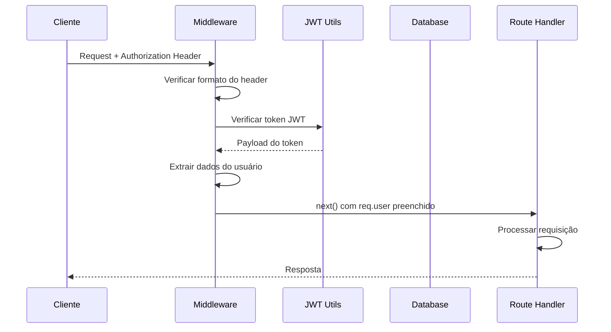

# 🛡️ Middlewares Module - Módulo de Middlewares

Este módulo contém todos os middlewares do sistema SUKATECH, responsáveis por funcionalidades transversais como autenticação, tratamento de erros e validação de requests.

## 📋 Índice

- [Visão Geral](#-visão-geral)
- [Estrutura do Módulo](#-estrutura-do-módulo)
- [Middlewares Disponíveis](#-middlewares-disponíveis)
- [Error Handler](#-error-handler)
- [Authentication Middleware](#-authentication-middleware)
- [Request Validation](#-request-validation)
- [Ordem de Execução](#-ordem-de-execução)
- [Exemplos de Uso](#-exemplos-de-uso)
- [Melhores Práticas](#-melhores-práticas)

## 🎯 Visão Geral

Os middlewares são funções que executam durante o ciclo de vida de uma requisição HTTP, permitindo:

- 🛡️ **Autenticação e Autorização** - Verificar se o usuário está logado
- ❌ **Tratamento de Erros** - Capturar e formatar erros de forma consistente
- ✅ **Validação de Dados** - Verificar se os dados da requisição são válidos
- 📝 **Logging** - Registrar informações sobre as requisições
- 🔒 **Segurança** - Implementar medidas de segurança como CORS e Rate Limiting

## 📁 Estrutura do Módulo

```
src/middlewares/
├── 📄 errorHandler.ts       # Tratamento centralizado de erros
├── 📄 isAuthenticated.ts    # Middleware de autenticação JWT
└── 📄 validateRequest.ts    # Validação de requests com Zod
```

### Fluxo de Middlewares

```
Request → [CORS] → [Rate Limit] → [Body Parser] → [Auth] → [Validation] → [Controller] → [Error Handler] → Response
```

## 🧩 Middlewares Disponíveis

### 🚫 errorHandler.ts

**Responsabilidade**: Tratamento centralizado de todos os erros da aplicação

```typescript
import type { NextFunction, Request, Response } from 'express';
import { AppError, isAppError } from '../utils/AppError.js';

export function errorHandler(err: unknown, _req: Request, res: Response, _next: NextFunction) {
  if (isAppError(err)) {
    return res.status(err.statusCode).json({ 
      message: err.message, 
      details: err.details 
    });
  }

  // Fallback para erros inesperados
  const statusCode = 500;
  const message = 'Internal server error';
  console.error('[ERROR]', err);
  return res.status(statusCode).json({ message });
}
```

**Características**:
- ✅ Trata erros customizados (`AppError`)
- ✅ Fallback para erros não previstos
- ✅ Logging para debugging
- ✅ Respostas padronizadas
- ✅ Não vaza informações sensíveis

### 🔒 isAuthenticated.ts

**Responsabilidade**: Verificação de autenticação via JWT

```typescript
import type { NextFunction, Request, Response } from 'express';
import type { AuthUser } from '../types/dtos/auth.dto.js';
import { verifyJwt } from '../utils/jwt.js';
import { AppError } from '../utils/AppError.js';

// Extensão do tipo Request do Express
declare module 'express-serve-static-core' {
  interface Request {
    user?: AuthUser;
  }
}

export function isAuthenticated(req: Request, _res: Response, next: NextFunction) {
  const authHeader = req.headers.authorization;
  
  if (!authHeader || !authHeader.startsWith('Bearer ')) {
    throw new AppError('Unauthorized', 401);
  }

  const token = authHeader.replace('Bearer ', '').trim();
  
  try {
    const payload = verifyJwt<{ sub: string } & Record<string, unknown>>(token);
    req.user = { id: payload.sub, ...payload } as AuthUser;
    return next();
  } catch {
    throw new AppError('Invalid token', 401);
  }
}
```

**Características**:
- ✅ Validação de tokens JWT
- ✅ Extração de dados do usuário
- ✅ Extensão do objeto Request
- ✅ Tratamento de erros padronizado
- ✅ Suporte a Bearer tokens

### ✅ validateRequest.ts

**Responsabilidade**: Validação de dados de entrada com Zod

```typescript
import type { NextFunction, Request, Response } from 'express';
import type { ZodSchema } from 'zod';
import { AppError } from '../utils/AppError.js';

export function validateRequest(schema: ZodSchema) {
  return (req: Request, _res: Response, next: NextFunction) => {
    try {
      const validatedData = schema.parse(req.body);
      req.body = validatedData; // Substitui com dados validados/sanitizados
      return next();
    } catch (error) {
      throw new AppError('Invalid request data', 400, error);
    }
  };
}
```

**Características**:
- ✅ Validação com Zod schemas
- ✅ Sanitização automática de dados
- ✅ Mensagens de erro detalhadas
- ✅ Tipo-segurança com TypeScript
- ✅ Flexível para qualquer schema

## ❌ Error Handler

### Classe AppError

```typescript
// utils/AppError.ts
export class AppError extends Error {
  public readonly statusCode: number;
  public readonly details?: unknown;

  constructor(message: string, statusCode = 400, details?: unknown) {
    super(message);
    this.name = 'AppError';
    this.statusCode = statusCode;
    this.details = details;
    Error.captureStackTrace?.(this, this.constructor);
  }
}

export function isAppError(error: unknown): error is AppError {
  return error instanceof AppError;
}
```

### Tipos de Erro Suportados

| Tipo | Status Code | Descrição |
|------|-------------|-----------|
| `AppError` | Customizável | Erros controlados da aplicação |
| `ValidationError` | 400 | Dados inválidos |
| `UnauthorizedError` | 401 | Não autenticado |
| `ForbiddenError` | 403 | Sem permissão |
| `NotFoundError` | 404 | Recurso não encontrado |
| `ConflictError` | 409 | Conflito de dados |
| `InternalError` | 500 | Erro interno do servidor |

### Estrutura de Resposta de Erro

```json
{
  "message": "Descrição do erro",
  "details": {
    "field": "email",
    "code": "invalid_email",
    "path": ["user", "email"]
  }
}
```

### Exemplos de Uso do Error Handler

```typescript
// Erro controlado
throw new AppError('Email já está em uso', 409);

// Erro com detalhes
throw new AppError('Dados inválidos', 400, {
  email: 'Email é obrigatório',
  senha: 'Senha deve ter pelo menos 8 caracteres'
});

// Erro de autorização
throw new AppError('Acesso negado', 403);
```

## 🔒 Authentication Middleware

### Fluxo de Autenticação



### Configuração do JWT

```typescript
// utils/jwt.ts
import jwt from 'jsonwebtoken';
import { env } from '../config/environment.js';

export function generateJwt(payload: Record<string, unknown>) {
  return jwt.sign(payload, env.JWT_SECRET, {
    expiresIn: env.JWT_EXPIRES_IN,
    algorithm: 'HS256'
  });
}

export function verifyJwt<T = any>(token: string): T {
  return jwt.verify(token, env.JWT_SECRET) as T;
}
```

### Uso em Rotas

```typescript
// routes/users.ts
import { isAuthenticated } from '../middlewares/isAuthenticated.js';

// Rota protegida
router.get('/profile', isAuthenticated, (req, res) => {
  // req.user está disponível e tipado
  return res.json({ user: req.user });
});

// Múltiplas rotas protegidas
router.use('/admin', isAuthenticated, adminRouter);
```

### Middleware de Autorização (Roles)

```typescript
// middlewares/authorize.ts
export function authorize(roles: string[]) {
  return (req: Request, _res: Response, next: NextFunction) => {
    if (!req.user) {
      throw new AppError('Authentication required', 401);
    }

    if (!roles.includes(req.user.role)) {
      throw new AppError('Insufficient permissions', 403);
    }

    return next();
  };
}

// Uso
router.delete('/users/:id', 
  isAuthenticated, 
  authorize(['ADMIN']), 
  deleteUser
);
```

## ✅ Request Validation

### Schemas com Zod

```typescript
// validators/user.schemas.ts
import { z } from 'zod';

export const createUserSchema = z.object({
  email: z
    .string()
    .email('Email inválido')
    .min(1, 'Email é obrigatório'),
    
  senha: z
    .string()
    .min(8, 'Senha deve ter pelo menos 8 caracteres')
    .max(100, 'Senha muito longa'),
    
  role: z
    .enum(['ADMIN', 'INSTRUTOR', 'COORDENADOR'])
    .default('INSTRUTOR')
});

export const updateUserSchema = createUserSchema.partial();
```

### Uso em Rotas

```typescript
// routes/users.ts
import { validateRequest } from '../middlewares/validateRequest.js';
import { createUserSchema, updateUserSchema } from '../validators/user.schemas.js';

// Validação na criação
router.post('/users', 
  validateRequest(createUserSchema),
  createUser
);

// Validação na atualização
router.put('/users/:id',
  isAuthenticated,
  validateRequest(updateUserSchema),
  updateUser
);
```

### Validação de Parâmetros

```typescript
// middlewares/validateParams.ts
export function validateParams(schema: ZodSchema) {
  return (req: Request, _res: Response, next: NextFunction) => {
    try {
      const validatedParams = schema.parse(req.params);
      req.params = validatedParams;
      return next();
    } catch (error) {
      throw new AppError('Invalid URL parameters', 400, error);
    }
  };
}

// Schema para parâmetros
const idParamSchema = z.object({
  id: z.string().regex(/^\d+$/, 'ID deve ser um número')
});

// Uso
router.get('/users/:id',
  validateParams(idParamSchema),
  getUserById
);
```

## 🔄 Ordem de Execução

### Configuração Recomendada

```typescript
// app.ts
import express from 'express';
import cors from 'cors';
import rateLimit from 'express-rate-limit';
import { errorHandler } from './middlewares/errorHandler.js';

const app = express();

// 1. Middlewares de segurança (primeiro)
app.use(cors());
app.use(rateLimit({
  windowMs: 15 * 60 * 1000, // 15 minutos
  max: 100 // máximo 100 requests por IP
}));

// 2. Body parsing
app.use(express.json({ limit: '10mb' }));
app.use(express.urlencoded({ extended: true }));

// 3. Rotas da aplicação
app.use('/api', router);

// 4. Error handler (sempre por último)
app.use(errorHandler);
```

### Ordem dos Middlewares nas Rotas

```typescript
router.post('/protected-endpoint',
  // 1. Autenticação (se necessário)
  isAuthenticated,
  
  // 2. Autorização (se necessário)
  authorize(['ADMIN']),
  
  // 3. Validação de dados
  validateRequest(schema),
  
  // 4. Controller
  controllerFunction
);
```

## 📝 Exemplos de Uso

### Middleware Customizado

```typescript
// middlewares/logger.ts
export function requestLogger(req: Request, _res: Response, next: NextFunction) {
  const start = Date.now();
  
  res.on('finish', () => {
    const duration = Date.now() - start;
    console.log(`${req.method} ${req.path} - ${res.statusCode} - ${duration}ms`);
  });
  
  return next();
}
```

### Middleware de Rate Limiting Específico

```typescript
// middlewares/rateLimits.ts
import rateLimit from 'express-rate-limit';

export const authRateLimit = rateLimit({
  windowMs: 15 * 60 * 1000, // 15 minutos
  max: 5, // máximo 5 tentativas de login
  message: {
    message: 'Muitas tentativas de login. Tente novamente em 15 minutos.'
  },
  standardHeaders: true,
  legacyHeaders: false,
});

// Uso
router.post('/auth/login', authRateLimit, login);
```

### Middleware de Cache

```typescript
// middlewares/cache.ts
export function cacheMiddleware(duration: number) {
  return (req: Request, res: Response, next: NextFunction) => {
    const key = req.originalUrl;
    const cached = cache.get(key);
    
    if (cached) {
      return res.json(cached);
    }
    
    // Interceptar res.json para salvar no cache
    const originalJson = res.json;
    res.json = function(data: any) {
      cache.set(key, data, duration);
      return originalJson.call(this, data);
    };
    
    return next();
  };
}
```

## 🛡️ Melhores Práticas

### Segurança

```typescript
// ✅ Sempre validar entrada
app.use(express.json({ limit: '10mb' })); // Limitar tamanho

// ✅ Rate limiting
app.use(rateLimit({
  windowMs: 15 * 60 * 1000,
  max: 100
}));

// ✅ Headers de segurança
app.use((req, res, next) => {
  res.setHeader('X-Content-Type-Options', 'nosniff');
  res.setHeader('X-Frame-Options', 'DENY');
  res.setHeader('X-XSS-Protection', '1; mode=block');
  next();
});
```

### Error Handling

```typescript
// ✅ Sempre usar AppError para erros controlados
throw new AppError('Usuário não encontrado', 404);

// ❌ Evitar throw de strings
throw 'Erro genérico'; // ❌

// ✅ Incluir contexto nos erros
throw new AppError('Validação falhou', 400, validationErrors);
```

### Validação

```typescript
// ✅ Sempre validar dados de entrada
router.post('/endpoint', validateRequest(schema), handler);

// ✅ Usar schemas específicos
const createSchema = z.object({ /* campos obrigatórios */ });
const updateSchema = createSchema.partial(); // todos opcionais

// ✅ Sanitizar dados automaticamente
const schema = z.object({
  email: z.string().email().toLowerCase().trim(),
  name: z.string().trim().max(100)
});
```

## 🧪 Testando Middlewares

### Teste do Error Handler

```typescript
// test/middlewares/errorHandler.test.ts
describe('Error Handler Middleware', () => {
  it('should handle AppError correctly', () => {
    const error = new AppError('Test error', 400);
    const req = {} as Request;
    const res = {
      status: jest.fn().mockReturnThis(),
      json: jest.fn()
    } as any;
    const next = jest.fn();

    errorHandler(error, req, res, next);

    expect(res.status).toHaveBeenCalledWith(400);
    expect(res.json).toHaveBeenCalledWith({
      message: 'Test error',
      details: undefined
    });
  });
});
```

### Teste do Authentication

```typescript
// test/middlewares/isAuthenticated.test.ts
describe('Authentication Middleware', () => {
  it('should authenticate valid token', () => {
    const token = generateJwt({ sub: '1', email: 'test@test.com' });
    const req = {
      headers: { authorization: `Bearer ${token}` }
    } as any;
    const res = {} as Response;
    const next = jest.fn();

    isAuthenticated(req, res, next);

    expect(req.user).toBeDefined();
    expect(req.user.id).toBe('1');
    expect(next).toHaveBeenCalled();
  });
});
```

## 🚀 Melhorias Futuras

### Funcionalidades Planejadas

- [ ] 📊 Middleware de métricas e monitoring
- [ ] 🔐 Middleware de rate limiting por usuário
- [ ] 📝 Middleware de auditoria e logs
- [ ] 🚀 Middleware de compressão de resposta
- [ ] 🔄 Middleware de retry automático
- [ ] 📱 Middleware específico para API mobile
- [ ] 🌐 Middleware de internacionalização

### Melhorias Técnicas

- [ ] 🧪 Testes completos para todos os middlewares
- [ ] 📝 Documentação automática de middlewares
- [ ] 🔍 Profiling de performance
- [ ] 💾 Cache distribuído
- [ ] 📈 Dashboard de métricas

---

**Módulo desenvolvido com ❤️ pela equipe SUKATECH**

> 💡 **Dica**: Middlewares são executados na ordem que são definidos. Sempre coloque o errorHandler por último e a autenticação antes da validação.